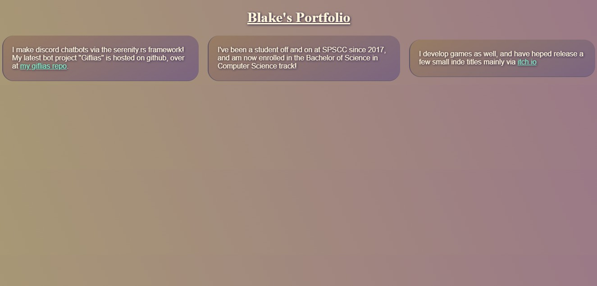

# Assignment 2: Personal Portfolio 

## Grids
I used the grid element to align all of the information blocks in my portfolio example

## @media queries
i used @media queries to control the horizontal layout of the information/content grid; the site checks whether or not the device aspect ratio is:
- square, or narrower:
  - in this case, the column layout shifts to single-column for scrollability

- between square and widescreen:
  - in this case, the colunm layout shifts to dual-column for a moderate ammoutn of info on a screen

- screens widescreen or wider:
  - in this case, the colunm layout switches to an automatically-sized 3-column layout to utilize the screen space effectively

